# Smart Display

A desk clock and info panel on an **ESP32-S3 Super Mini** with a **1.69" ST7789 240×280** display:
eight display modes, live weather and crypto prices, a touch button, and a web interface
that shows a live snapshot of the screen.

<p align="center">
  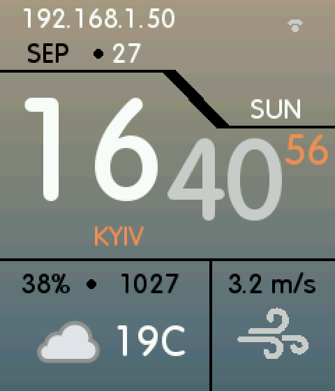
  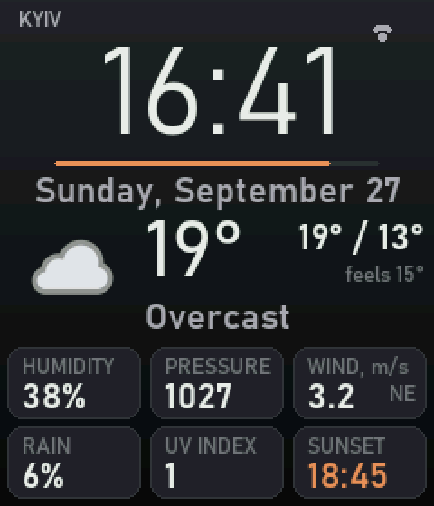
  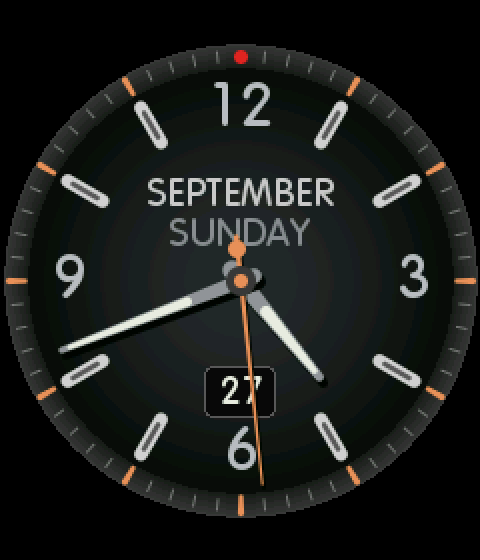
  
</p>

> **Upgrading from the old Arduino IDE version (1.0.x)?** Web update will not work and the
> first USB flash erases your settings — see [CHANGELOG.md](CHANGELOG.md) first.

## Display modes

| | Mode | What it shows |
|---|---|---|
|  | **Clock** | Classic layout: large time, date, weekday, city, humidity, pressure, wind, weather icon |
| 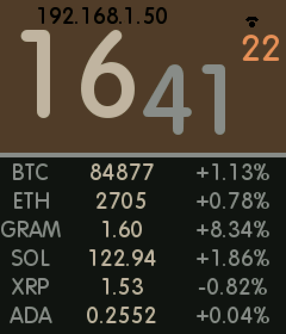 | **Crypto** | Classic layout: clock plus six coin prices with 24 h change |
| 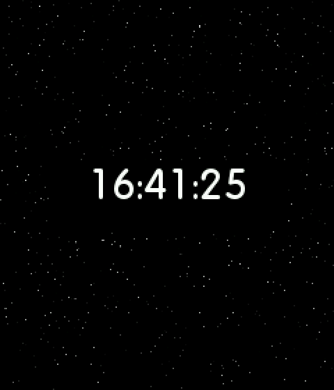 | **Space** | Starfield flight with a digital clock |
|  | **Analog** | Chronograph dial: skeleton hands, date window, month and weekday |
| 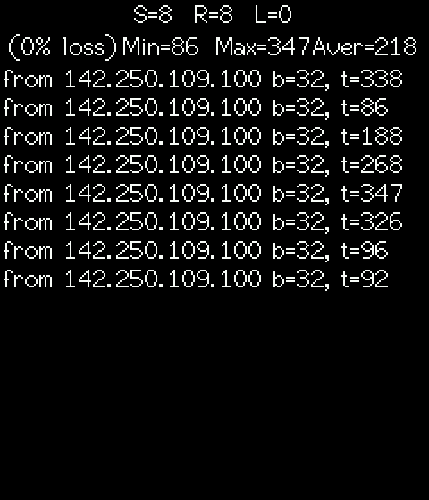 | **Ping** | DNS + TCP + HTTP latency to a host, once per second, with statistics |
| 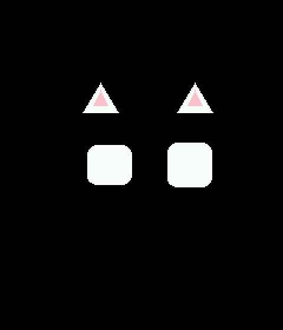 | **Cat** | Animated cat eyes with random emotions |
|  | **Weather** | Modern layout: time, condition, max/min, feels-like, humidity, pressure, wind, rain chance, UV, sunrise/sunset |
|  | **Markets** | Modern layout: six coins with a 24 h hourly chart, price, change and turnover |

## Hardware

| Part | Notes |
|---|---|
| ESP32-S3 Super Mini | 4 MB flash; PSRAM recommended (the frame buffer lives there) |
| ST7789 240×280 SPI display | 1.69", 3.3 V |
| TTP223 touch module | optional; a bare wire on a touch GPIO also works (`TOUCH_IS_TTP223 = false`) |

Wiring:

<p align="center">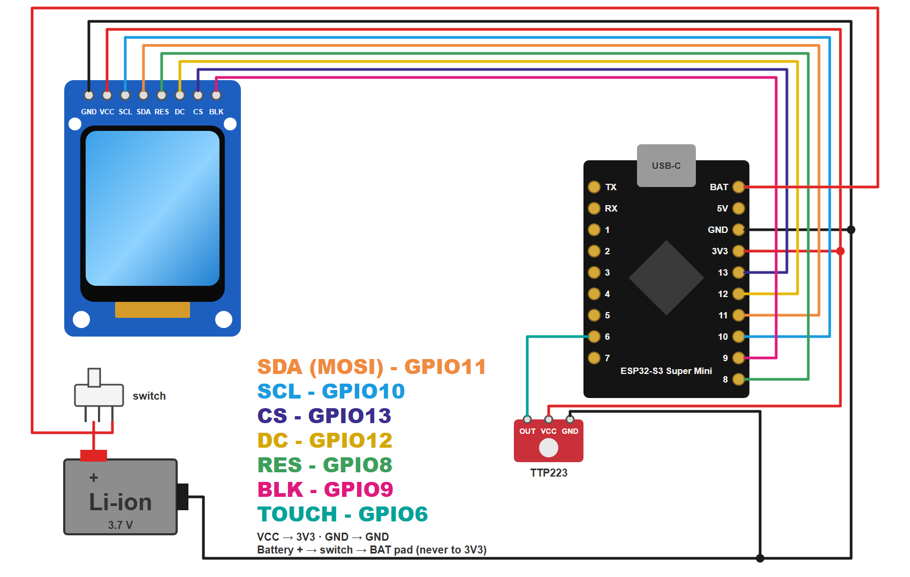</p>

The Li-ion cell goes through the switch to the **BAT** pad, which feeds the on-board regulator.
Never connect a Li-ion cell (up to 4.2 V) to 3V3. Full pin table: [`docs/pinout.html`](docs/pinout.html).

| Display | Super Mini | | Touch (TTP223) | Super Mini |
|---|---|---|---|---|
| GND | GND | | OUT | GPIO 6 |
| VCC | 3V3 | | VCC | 3V3 |
| SCL | GPIO 10 | | GND | GND |
| SDA | GPIO 11 | | | |
| RES | GPIO 8 | | | |
| DC | GPIO 12 | | | |
| CS | GPIO 13 | | | |
| BLK | GPIO 9 | | | |

## Flash the firmware — no software to install

All you need is **Google Chrome or Microsoft Edge** on a computer (Windows, macOS or Linux)
and a USB-C **data** cable. Flashing runs in the browser.

1. **Download** `smart-display-full.bin` (from the `firmware/` folder or the Releases page).
2. **Plug in** the ESP32-S3 Super Mini with the USB-C cable.
3. **Open** [espressif.github.io/esptool-js](https://espressif.github.io/esptool-js/) in Chrome or Edge.
4. Set **Baudrate** to `460800` and press **Connect**. In the pop-up pick the port named
   *USB JTAG/serial debug unit* (or *ESP32-S3*) and press **Connect**.
5. In the **Flash Address** field type `0x0`, choose `smart-display-full.bin`
   and press **Program**. Wait for the log to say the write is finished (about a minute).
6. Press the **RST** button on the board (or unplug and plug the cable back in).
   The display shows *Connecting to Wi-Fi* and then the setup screen — continue with
   [First setup](#first-setup).

**If the port does not appear or Connect fails:**

- Use a cable that carries data — many USB-C cables only charge.
- Put the board into download mode: **hold BOOT, press and release RST, then release BOOT**,
  and press Connect again.
- Close anything else that uses the port (Arduino IDE serial monitor, another browser tab).
- Firefox and Safari do not support Web Serial — use Chrome or Edge.

**Updating later:** once the device is on Wi-Fi, you don't need the cable at all — open its web
page, **System → Firmware update**, and upload `smart-display-ota.bin`.

> Which file? `*-full.bin` contains the bootloader, partition table and app and must be written
> at `0x0`. `*-ota.bin` (the plain `firmware.bin`) is the app only — for the web updater, or at
> `0x10000` if you flash with esptool. Writing the app-only file at `0x0` leaves the board unable to boot.

## Build from source

Requires [PlatformIO](https://platformio.org/).

```bash
pio run -t upload
```

After the first flash, later updates can go over Wi-Fi: **System → Firmware update** in the web
interface (upload `.pio/build/supermini/firmware.bin`).

## First setup

1. On first boot the device starts an open access point **`SmartDisplay`**.
2. Connect to it; the setup page opens by itself (or go to `http://192.168.4.1`).
3. Pick your Wi-Fi network and enter the password. Leave the city empty to detect it by IP.
4. For weather, get a free key at [weatherapi.com](https://www.weatherapi.com/my/) and paste it
   under **System → Weather**.

## Touch button

| Where | Gesture | Action |
|---|---|---|
| any mode | short tap | next mode |
| any mode | hold 2 s | open the menu |
| menu | short tap | next item |
| menu | hold 1 s | select (the bar at the bottom turns white) |

<p align="center">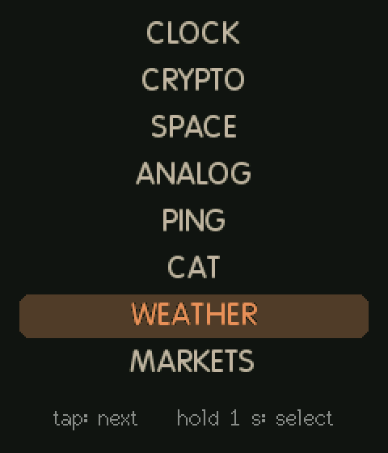</p>

## Web interface

Open the device's IP address in any browser on the same network (the IP is shown in the Clock and
Crypto modes and in the serial log). In access point mode the pages are at `http://192.168.4.1`.
All pages share one dark style and work on a phone.

### Dashboard

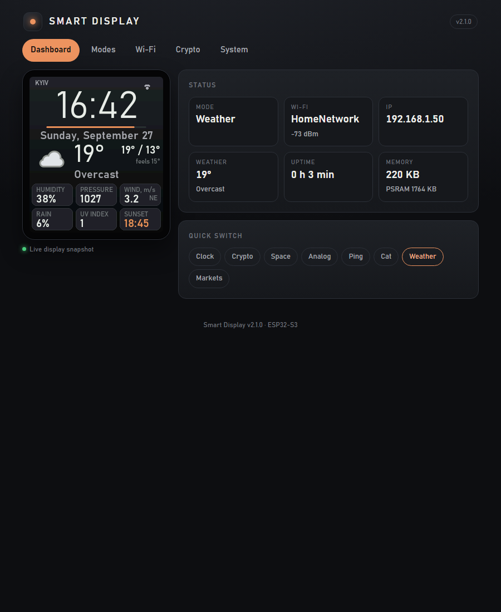

The start page. On the left is a **live snapshot of the display**, refreshed every 3 seconds —
you see exactly what the device shows right now. On the right:

- **Status** — current mode, Wi-Fi network and signal strength, IP address, current weather,
  uptime and free memory (internal RAM and PSRAM).
- **Quick switch** — one button per mode. A click switches the display instantly; the snapshot
  updates a moment later.

### Modes

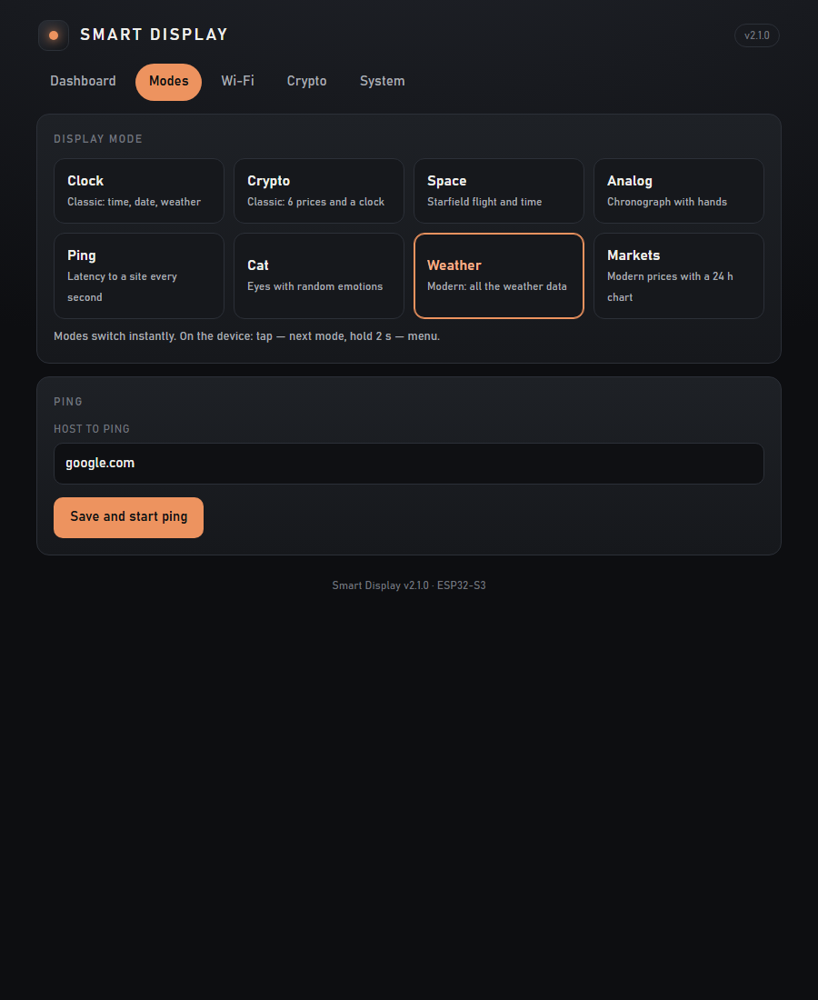

All eight display modes as cards with a short description; the active one is highlighted.
A click switches the mode without reloading the page. The **Ping** card below sets the host that
the Ping mode measures (default `google.com`).

### Wi-Fi

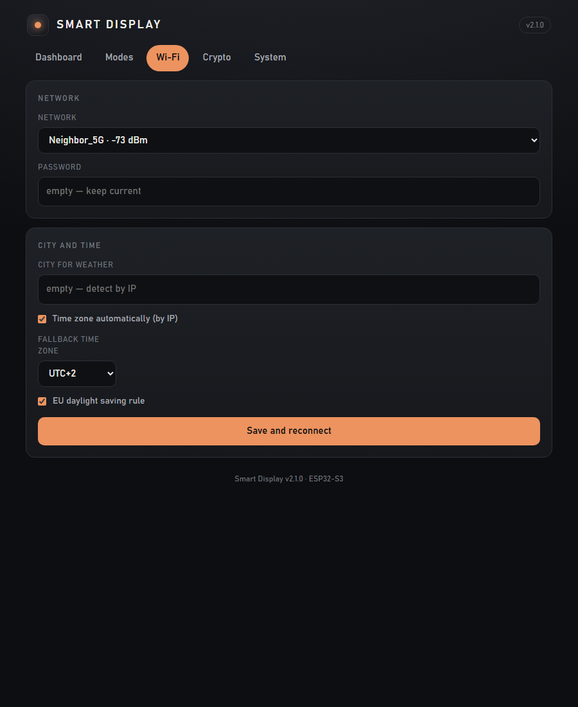

- **Network** — nearby networks with signal strength, and the password. Leave the password empty
  to keep the saved one.
- **City and time** — the city used for weather (leave empty to detect it by IP), automatic time
  zone by IP, and a fallback time zone with an optional EU daylight-saving rule for when
  detection is off or fails.

**Save and reconnect** stores the settings and reboots the device to join the network.

### Crypto

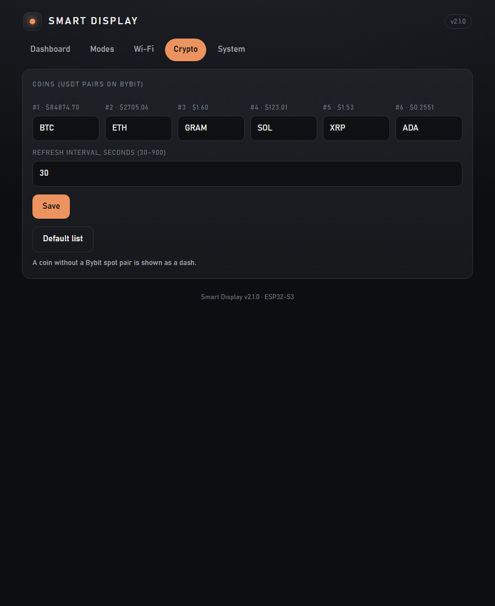

Six coin tickers shown in the Crypto and Markets modes, as USDT pairs on Bybit's spot market.
The current price is shown above each field. **Refresh interval** sets how often prices are
fetched (30–900 s). Changes apply without a reboot; **Default list** restores
BTC, ETH, BNB, SOL, XRP, ADA. A coin with no Bybit spot pair is shown as a dash.

### System

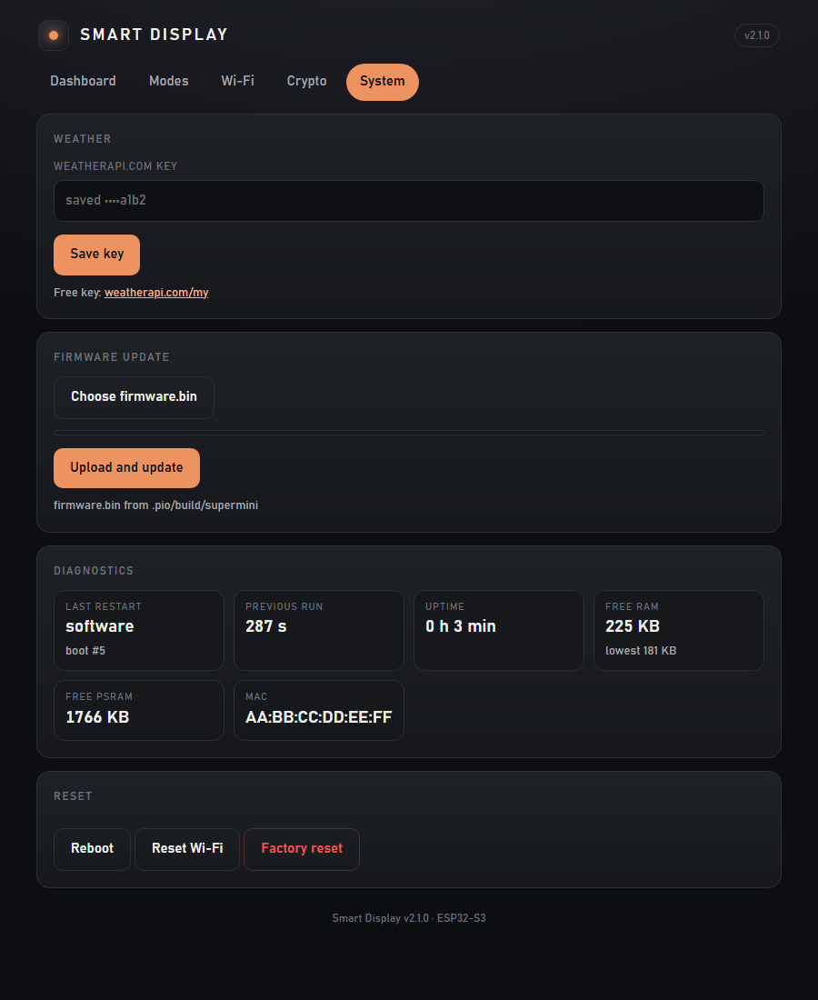

- **Weather** — the WeatherAPI.com key. The saved key is never sent back to the page; only its
  last four characters are shown. Leave the field empty to keep it.
- **Firmware update** — choose `firmware.bin` and upload it over Wi-Fi, with a progress bar.
  The device reboots into the new firmware.
- **Diagnostics** — reason for the last restart, boot counter, how long the previous run lasted,
  uptime, free RAM (with the lowest value seen), free PSRAM and the MAC address.
- **Reset** — reboot, forget Wi-Fi (the device starts its access point again), or erase all
  settings.

### API

| Endpoint | Purpose |
|---|---|
| `GET /screen.bmp` | Current frame as a 240×280 BMP |
| `GET /api/status` | Mode, network, memory, weather — JSON |
| `POST /mode` | `mode=0..7` switches the display |
| `POST /update` | OTA firmware upload |

## Data sources

| Data | Source |
|---|---|
| Weather and forecast | [WeatherAPI.com](https://www.weatherapi.com/) (free key) |
| Crypto prices and 24 h charts | [Bybit](https://bybit-exchange.github.io/docs/v5/market/tickers) public spot API, USDT pairs |
| City and time zone | [ip-api.com](https://ip-api.com/) |
| Time | NTP (`pool.ntp.org`) |

## How it works

- **Two tasks.** The loop task draws the screen and serves the web UI; a network task on the
  other core does all HTTPS requests. The screen never waits for the network.
- **PSRAM frame buffer.** Everything is drawn into a 240×280 buffer in PSRAM, next to a copy of
  the mode's clean background. Clearing a text field is a `memcpy`, anti-aliased text blends
  against the real background, and only changed rectangles are sent to the panel.
- **Settings** live in NVS and apply instantly — no reboot for mode, coins, weather key or
  time zone.
- **Time zone** comes from the IANA zone reported by ip-api, mapped to a POSIX rule, so
  daylight saving switches on the right day.
- **Diagnostics.** The reset reason, boot counter and previous uptime survive a reboot and are
  shown under **System → Diagnostics**.

## Project layout

```
src/
  main.cpp        app states, startup
  Display.*       all rendering, frame buffer, modes, menu
  NetService.*    Wi-Fi and the network task (weather, crypto, geolocation)
  WebUI.*         web interface and API
  Settings.*      NVS-backed settings
  TimeZone.*      SNTP and POSIX time zone
  Controls.*      touch button and gestures
  CatMode.*       cat mode; eyes/ holds the eye engine
  Diag.*          reboot diagnostics
  assets/         fonts and bitmaps (generated headers)
tools/
  make_vlw.py         regenerates the anti-aliased fonts
  capture_screens.ps1 re-takes every screenshot in docs/screens from a running device
docs/
  pinout.html     wiring diagram
  screens/        screenshots
```

## Credits

- Cat eyes: based on the esp32-eyes engine © 2020 Luis Llamas (AGPL-3.0), see `src/eyes/`
- [TFT_eSPI](https://github.com/Bodmer/TFT_eSPI), [ArduinoJson](https://arduinojson.org/),
  [PNGdec](https://github.com/bitbank2/PNGdec)

## License

[GNU AGPL-3.0](LICENSE). The cat eyes engine this project builds on is AGPL-3.0, so the whole
firmware is released under the same license: you may use, modify and redistribute it, but any
modified version you distribute (or run as a network service) must publish its source under
AGPL-3.0 too and keep the credits above.
